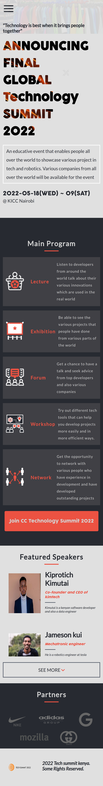
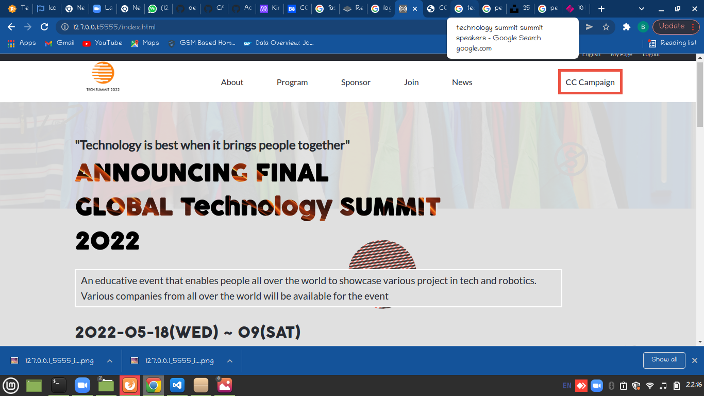

# Global technology summit

> The webpage about the fifa world cup that will be in qatar

A simple website for a technology global summit
## Built With

- HTML/CSS/JavaScript

## Live Demo

[Live Demo Link](https://kimutai01.github.io/html-css-capstone/)

## Video presentation

[Click here to see the presentation](https://www.loom.com/share/03ec5e0d08784615b6e2abdb97ce344e)

## Getting Started

### To see the live demo please click an the above link, to launch the project locally please follow the next steps:

To get a local copy up and running follow these simple example steps.

## Authors

👤 **Author1**

- GitHub: [@GitHub](https://github.com/Kimutai01)
- Twitter: [@twitterhandle](https://twitter.com/twitterhandle)
- LinkedIn: [@LinkedIn](https://www.linkedin.com/in/kimutai-kiprotich-1b5045216/)

## 🤝 Contributing

Contributions, issues, and feature requests are welcome!

Feel free to check the [issues page](../../issues/).

## Show your support

Give a ⭐️ if you like this project!

## Acknowledgments

- Design by: [Cindy Shin](https://www.behance.net/adagio07) (the author of the original design)
